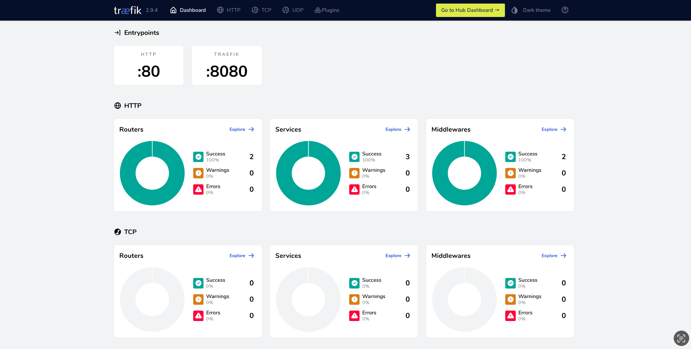

# Quick Start

A simple use case of Traefik Proxy and Kubernetes
{: .subtitle }

## Launch Traefik Proxy in a Kubernetes cluster

To run Traefik Proxy in a Kubernetes cluster you need to create
[resources files](kubernetes-resources.md) to grant Traefik access
to your cluster and configure Traefik to act as a reverse proxy
for your application.

To create these resources for you, we created a script that:

- Copies example resource files from a [sample project](https://github.com/VirtuaCreative/traefik-wizard/tree/main/proxy-kube-resources)
to your computer in a directory called `traefik`.
- Deploys the Traefik Proxy Dashboard on port 8080.
- Deploys and an example application [`hello-world`](https://github.com/VirtuaCreative/html-hello-world)
behind Traefik as reverse proxy on port 80.

To execute the script:

1. Open the terminal in your cluster's directory where you wish
to add Traefik's resource files.
1. Run:

```shell
curl -s https://raw.githubusercontent.com/VirtuaCreative/traefik-wizard/main/traefik-proxy-install.sh > ./traefik-proxy-install.sh
sh traefik-proxy-install.sh
```

It's done! If executed successfully, you can access the Traefik Proxy Dashboard on your
browser under [`http://localhost:8080`](http://localhost:8080):



And to access the `hello-world` application, run  `curl -v http://localhost/`.

If you are on Minikube, you need to run these services manually:

1. Run `minikube service traefik-dashboard-service` to launch the Traefik Proxy Dashboard.
1. Run `minikube service hello-world` to preview your `hello-world` application on your browser.

You can modify the resource files as you see fit. And you can delete the
`traefik-proxy-install.sh` file as you no longer need it.

## Modify the example resources

After setting up Traefik Proxy for the first time with the help of the script
above, you can go through the [resources reference](kubernetes-resources.md)
to learn how to configure them to your needs.

!!! warning

    This script aims to get you started quickly. To use Traefik Proxy in a production environment,
    make sure to read through the [details of each resource file](kubernetes-resources.md)
    and adjust them according to your needs.

!!! question "Going further"

    - [Publish your application in a few minutes with Traefik Hub](https://doc.traefik.io/traefik-hub/).

<!-- ^ I'd follow up with a quick start for publishing the hello-world app with hub basic auth. -->
